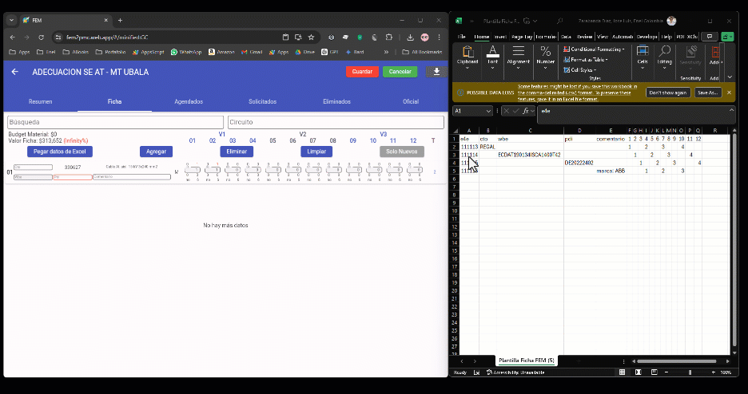

# 📦 FEM - Material Planning & Management System

<div align="center">


[](https://opensource.org/licenses/MIT)
[](https://flutter.dev)
[](http://makeapullrequest.com)

**Enterprise-grade Material Planning & Inventory Management Application**

[Demo](#demo) • [Features](#-features) • [Tech Stack](#-tech-stack) • [Architecture](#-architecture) • [Installation](#-installation) • [Contact](#-contact)

</div>

---

## 📋 About

**FEM** (Flujo de Ejecución de Materiales) is a comprehensive enterprise application designed to streamline material planning, inventory management, and project tracking for large-scale operations. Built with Flutter for cross-platform deployment, it integrates with Firebase for real-time data synchronization and Google Apps Script for SAP/ERP data integration.

> ⚠️ **Note:** This is a sanitized version of a production application. All credentials and sensitive data have been externalized to environment variables.

---

## 📸 Demo

<div align="center">

| Feature Demo | Copy & Paste Operations |
|:---:|:---:|
|  |  |

</div>

---

## ✨ Features

### 📊 **Core Modules**

| Module | Description |
|--------|-------------|
| 🗂️ **Fichas** (Data Sheets) | Complete material data sheet management with CRUD operations |
| 📈 **Disponibilidad** (Availability) | Real-time material availability tracking and visualization |
| 🔄 **Versiones** (Versions) | Version control system for material specifications |
| 📋 **Pedidos** (Orders) | Order management and tracking system |
| 💰 **Budget** | Budget planning and cost tracking |
| 📊 **Analytics** | Visual analytics dashboard with charts |

### 🔐 **Security & Authentication**

- 🔑 Firebase Authentication (Email/Password)
- 👥 Role-based access control (RBAC)
- 🛡️ Profile-based permissions system
- ✅ Email verification workflow

### 🔗 **Integrations**

- 📡 **Google Apps Script** - Backend API integration
- 🗄️ **Firebase Realtime Database** - Real-time data sync
- 📊 **Firebase Analytics** - Usage tracking
- ⚡ **Firebase Performance** - Performance monitoring
- 📁 **Google Drive** - File upload and storage

### 💡 **Additional Features**

- 🎨 Dynamic theme customization (light/dark mode)
- 🔔 Real-time notifications and messages
- 📱 Responsive design (Web, Mobile, Desktop)
- 🔍 Advanced search and filtering
- 📥 CSV/Excel data export
- 🖼️ Image gallery integration

---

## 🛠 Tech Stack

### **Frontend**
```
├── Flutter 3.0+          # Cross-platform UI framework
├── Dart                  # Programming language
├── flutter_bloc          # State management (BLoC pattern)
├── GetX                  # Routing & dependency injection
└── fl_chart              # Data visualization
```

### **Backend & Services**
```
├── Firebase Auth         # Authentication
├── Firebase Realtime DB  # Real-time database
├── Firebase Analytics    # Analytics tracking
├── Firebase Performance  # Performance monitoring
└── Google Apps Script    # Custom API endpoints
```

### **Development Tools**
```
├── flutter_dotenv        # Environment variables
├── flutter_bloc          # State management
├── http                  # HTTP client
└── intl                  # Internationalization
```

---

## 🏗 Architecture

This project follows a **modular MVC architecture** with BLoC pattern for state management:

```
lib/
├── bloc/                    # Global BLoC (state management)
│   ├── main_bloc.dart       # Main application BLoC
│   ├── main_event.dart      # Events
│   └── main_state.dart      # States
│
├── [module_name]/           # Feature modules
│   ├── controller/          # Business logic & BLoC
│   ├── model/               # Data models
│   └── view/                # UI components
│
├── resources/               # Shared resources
│   ├── constant/            # Constants & API configs
│   ├── env_config.dart      # Environment configuration
│   └── ...                  # Utilities
│
├── firebase_options.dart    # Firebase configuration
└── main.dart                # Application entry point
```

### **Module Structure Example**
```
fem/                         # FEM (Main) module
├── controller/
│   ├── fem_actions.dart     # Actions/Events
│   └── fem_controller.dart  # Business logic
├── model/
│   ├── fem_model.dart       # Data model
│   └── fem_item.dart        # Item model
└── view/
    ├── fem_page.dart        # Main page
    └── fem_widgets.dart     # Reusable widgets
```

---

## 🚀 Installation

### Prerequisites

- [Flutter SDK](https://flutter.dev/docs/get-started/install) (≥ 3.0.0)
- [Firebase CLI](https://firebase.google.com/docs/cli)
- A Firebase project
- Google Apps Script deployments (for backend APIs)

### Setup Steps

1. **Clone the repository**
   ```bash
   git clone https://github.com/[YOUR_USERNAME]/fem-app.git
   cd fem-app
   ```

2. **Install dependencies**
   ```bash
   flutter pub get
   ```

3. **Configure environment variables**
   ```bash
   # Copy the example environment file
   cp .env.example .env
   
   # Edit .env with your actual credentials
   # (See Configuration section below)
   ```

4. **Set up Firebase**
   
   - Create a Firebase project at [Firebase Console](https://console.firebase.google.com)
   - Enable Authentication (Email/Password)
   - Create a Realtime Database
   - Copy your web app configuration to `.env`

5. **Configure Google Apps Script APIs** (Optional)
   
   - Deploy your Google Apps Script as web apps
   - Add the deployment URLs to your `.env` file

6. **Run the application**
   ```bash
   # Web
   flutter run -d chrome
   
   # Android
   flutter run -d android
   
   # iOS
   flutter run -d ios
   ```

---

## ⚙️ Configuration

### Environment Variables

Create a `.env` file in the root directory with the following variables:

```env
# Firebase Configuration
FIREBASE_API_KEY=your_api_key
FIREBASE_APP_ID=your_app_id
FIREBASE_MESSAGING_SENDER_ID=your_sender_id
FIREBASE_PROJECT_ID=your_project_id
FIREBASE_AUTH_DOMAIN=your_project.firebaseapp.com
FIREBASE_DATABASE_URL=https://your_project.firebaseio.com
FIREBASE_STORAGE_BUCKET=your_project.appspot.com
FIREBASE_MEASUREMENT_ID=your_measurement_id

# Google Apps Script APIs
API_ENVIAR_SOLPE=https://script.google.com/macros/s/.../exec
API_FEM=https://script.google.com/macros/s/.../exec
API_OE_MES=https://script.google.com/macros/s/.../exec
API_FILE_UPLOAD=https://script.google.com/macros/s/.../exec
```

### Firebase Setup (Android)

1. Copy `android/app/google-services.json.example` to `android/app/google-services.json`
2. Replace with your Firebase project's `google-services.json`

### Firebase Setup (iOS)

1. Download `GoogleService-Info.plist` from Firebase Console
2. Place it in `ios/Runner/`

---

## 📂 Project Structure

```
fem-app/
├── android/                 # Android native code
├── ios/                     # iOS native code
├── lib/                     # Dart source code
│   ├── bloc/                # Global state management
│   ├── [modules]/           # Feature modules
│   ├── resources/           # Shared utilities
│   └── main.dart            # Entry point
├── images/                  # App images & icons
├── web/                     # Web-specific files
├── .env.example             # Environment template
├── pubspec.yaml             # Dependencies
└── README.md                # This file
```

---

## 🧪 Testing

```bash
# Run all tests
flutter test

# Run with coverage
flutter test --coverage
```

---

## 📦 Building

### Web
```bash
flutter build web --release
```

### Android
```bash
flutter build apk --release
# or for App Bundle
flutter build appbundle --release
```

### iOS
```bash
flutter build ios --release
```

---

## 🤝 Contributing

Contributions are welcome! Please feel free to submit a Pull Request.

1. Fork the repository
2. Create your feature branch (`git checkout -b feature/AmazingFeature`)
3. Commit your changes (`git commit -m 'Add some AmazingFeature'`)
4. Push to the branch (`git push origin feature/AmazingFeature`)
5. Open a Pull Request

---

## 📄 License

This project is licensed under the MIT License - see the [LICENSE](LICENSE) file for details.

---

## 📬 Contact

**José Luis Zarabanda**

[](https://www.linkedin.com/in/zarabandajose/)
[](https://github.com/jozzer182)
[](mailto:jlzarabandad@gmail.com)

---

<div align="center">

**⭐ If you found this project useful, please consider giving it a star! ⭐**

Made with ❤️ using Flutter

</div>
